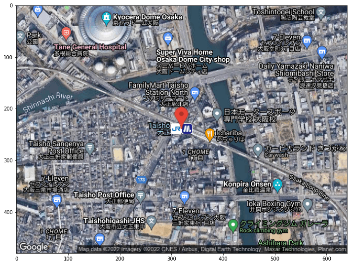

#### **このページは[こちらのブログ記事](https://kentapt.hatenablog.com/entry/2022/01/04/150408?_ga=2.19275389.494030156.1641034049-1601353361.1630730568)のコードやデータをまとめたものです**  

<br>

# Directions API (Google Maps Platform) を jupyter notebookからコールしてルート間の距離と所要時間を取得する  

この記事では、**Directions API(Google Maps Platform)** を jupyter notebookからコールして、東京ドームから山手線の各駅までの距離と所要時間を自動的に取得する方法について勉強したのでここにまとめたいと思います。  
　例えばスマホにインストールしたGoogle Mapのアプリから手動で任意の2地点を入力すれば、そこまで移動するときの距離や時間がわかりますが、複数の地点があれば毎回入力するのは大変です。そこで、ここでは、任意のまでの距離や時間を自動的に計算すべく、**Directions API**を利用します。　　
 
距離と時間を計算するコードはこちらの、kngsym2018さまのブログを参考にさせていただきました。  
https://qiita.com/kngsym2018/items/15f19a88ea37c1cd3646  

航空写真を取得するコードに関しては、こちらのSpooky_Maskmanさまのブログを参考にさせていただきました。  
https://qiita.com/Spooky_Maskman/items/9f4c487ed884d803641b  

この記事は、上の二つの記事をもとに、大阪環状線の情報を用いて勉強したときのまとめになっていて、特に技術的には新たな情報はありませんが、下のページにコードやデータをアップロードしているので、何かの役に立てば幸いです。  


 # APIキーの取得  
 まずはじめに、jupyter notebookからGoogle Maps PlatformにアクセスするためにAIPキーを取得する必要があります。その取得については、以下の記事がわかりやすかったです。こちらをご参照ください。  
 
 https://qiita.com/Haruka-Ogawa/items/997401a2edcd20e61037

# 京セラドーム大阪 ～ 大阪環状線の各駅までの距離を調べるコードについて  
## モジュールのインポート


```python
import numpy as np
import pandas as pd
import geocoder as ge
from geopy import distance
import csv
import json
import requests
#import urllib.requests, json
import urllib.parse
import datetime
import googlemaps
import cv2
import matplotlib.pyplot as plt
%matplotlib inline
```

## 目的地のリストを読み込み＆簡単な後処理  
インターネットから自動的に大阪環状線の駅名のリストを得ることも可能な気もしますが、ひとまずCSVファイルに駅名のリストを保存しています。


```python
df = pd.read_csv('test.csv', encoding="shift-jis")
# カラム名'loop_line_station'列を取り出す
address = df['loop_line_station']
# Dtaframe⇒listに変換
address_list = address.to_list()
print(address_list)
```

    ['天王寺', '寺田町', '桃谷', '鶴橋', '玉造', '森ノ宮', '大阪城公園', '京橋', '桜ノ宮', '天満', '大阪', '福島', '野田', '西九条', '弁天町', '大正', '芦原橋', '今宮', '新今宮']
    

## Google Maps Platform Directions API endpointとAPIキーの設定  
APIキーはご自身で取得したものを入力してください


```python
endpoint = 'https://maps.googleapis.com/maps/api/directions/json?'
api_key = 'aaaaaaaaaaaaaaa-BBBBBBBBBBBBBBBBBBB'
```

## 各駅の緯度経度をforループで取り出し、京セラドーム大阪からの運転距離と運転時間を求める


```python
# 運転距離と運転時間の結果を入れる空の配列を作成
duration=[]
distance=[]

for i in range(len(address)):
    dep_time = '2022/1/6 6:00'
    origin='京セラドーム大阪'
    destination = address_list[i] + '駅 大阪'
    print(destination + " について検索中")
    # UNIX時間への変換
    dtime = datetime.datetime.strptime(dep_time, '%Y/%m/%d %H:%M')
    unix_time = int(dtime.timestamp())
    
    # 実行内容
    nav_request = 'origin={}&destination={}&departure_time={}&key={}'.format(origin,destination,unix_time,api_key)
    nav_request = urllib.parse.quote_plus(nav_request, safe='=&')
    request = endpoint + nav_request

    # 上のrequestをもとに、google Maps Platform Directions APIを実行
    response = urllib.request.urlopen(request).read()

    #結果(JSON)を取得
    directions = json.loads(response)

    #所要時間を取得
    for key in directions['routes']:
        # print(key) # titleのみ参照
        # print(key['legs']) 
        for key2 in key['legs']:
            duration_i=key2['duration_in_traffic']['text']
            duration.append(duration_i)
            distance_i=key2['distance']['text']
            distance.append(distance_i)
```

    天王寺駅 大阪 について検索中
    寺田町駅 大阪 について検索中
    桃谷駅 大阪 について検索中
    鶴橋駅 大阪 について検索中
    玉造駅 大阪 について検索中
    森ノ宮駅 大阪 について検索中
    大阪城公園駅 大阪 について検索中
    京橋駅 大阪 について検索中
    桜ノ宮駅 大阪 について検索中
    天満駅 大阪 について検索中
    大阪駅 大阪 について検索中
    福島駅 大阪 について検索中
    野田駅 大阪 について検索中
    西九条駅 大阪 について検索中
    弁天町駅 大阪 について検索中
    大正駅 大阪 について検索中
    芦原橋駅 大阪 について検索中
    今宮駅 大阪 について検索中
    新今宮駅 大阪 について検索中
    


```python
df_distance=pd.DataFrame(distance,columns=['distance'])
df_duration=pd.DataFrame(duration,columns=['duration'])
df_result = pd.concat([pd.DataFrame(address),df_distance,df_duration],axis=1)
df_result.head(20)
```


<div>
<style scoped>
    .dataframe tbody tr th:only-of-type {
        vertical-align: middle;
    }

    .dataframe tbody tr th {
        vertical-align: top;
    }

    .dataframe thead th {
        text-align: right;
    }
</style>
<table border="1" class="dataframe">
  <thead>
    <tr style="text-align: right;">
      <th></th>
      <th>loop_line_station</th>
      <th>distance</th>
      <th>duration</th>
    </tr>
  </thead>
  <tbody>
    <tr>
      <th>0</th>
      <td>天王寺</td>
      <td>9.1 km</td>
      <td>14 mins</td>
    </tr>
    <tr>
      <th>1</th>
      <td>寺田町</td>
      <td>10.2 km</td>
      <td>17 mins</td>
    </tr>
    <tr>
      <th>2</th>
      <td>桃谷</td>
      <td>6.0 km</td>
      <td>19 mins</td>
    </tr>
    <tr>
      <th>3</th>
      <td>鶴橋</td>
      <td>5.1 km</td>
      <td>17 mins</td>
    </tr>
    <tr>
      <th>4</th>
      <td>玉造</td>
      <td>7.2 km</td>
      <td>14 mins</td>
    </tr>
    <tr>
      <th>5</th>
      <td>森ノ宮</td>
      <td>6.7 km</td>
      <td>12 mins</td>
    </tr>
    <tr>
      <th>6</th>
      <td>大阪城公園</td>
      <td>7.7 km</td>
      <td>15 mins</td>
    </tr>
    <tr>
      <th>7</th>
      <td>京橋</td>
      <td>7.9 km</td>
      <td>16 mins</td>
    </tr>
    <tr>
      <th>8</th>
      <td>桜ノ宮</td>
      <td>9.3 km</td>
      <td>17 mins</td>
    </tr>
    <tr>
      <th>9</th>
      <td>天満</td>
      <td>7.8 km</td>
      <td>14 mins</td>
    </tr>
    <tr>
      <th>10</th>
      <td>大阪</td>
      <td>4.9 km</td>
      <td>14 mins</td>
    </tr>
    <tr>
      <th>11</th>
      <td>福島</td>
      <td>4.4 km</td>
      <td>13 mins</td>
    </tr>
    <tr>
      <th>12</th>
      <td>野田</td>
      <td>3.9 km</td>
      <td>11 mins</td>
    </tr>
    <tr>
      <th>13</th>
      <td>西九条</td>
      <td>4.4 km</td>
      <td>12 mins</td>
    </tr>
    <tr>
      <th>14</th>
      <td>弁天町</td>
      <td>2.1 km</td>
      <td>6 mins</td>
    </tr>
    <tr>
      <th>15</th>
      <td>大正</td>
      <td>0.6 km</td>
      <td>3 mins</td>
    </tr>
    <tr>
      <th>16</th>
      <td>芦原橋</td>
      <td>2.6 km</td>
      <td>9 mins</td>
    </tr>
    <tr>
      <th>17</th>
      <td>今宮</td>
      <td>3.0 km</td>
      <td>10 mins</td>
    </tr>
    <tr>
      <th>18</th>
      <td>新今宮</td>
      <td>3.8 km</td>
      <td>12 mins</td>
    </tr>
  </tbody>
</table>
</div>


## 下準備１: 大正駅の経度と緯度を取得する


```python
gmaps = googlemaps.Client(key=api_key)
address = u'大正駅'
result = gmaps.geocode(address)
lat = result[0]["geometry"]["location"]["lat"]
lon = result[0]["geometry"]["location"]["lng"]
print (lat,lon)
```

    34.6657822 135.4792475
    

## 下準備２: 大正駅を中心とした衛星画像を取得する  
こちらのコードは上の、[Spooky_Maskmanさまのブログ](https://qiita.com/Spooky_Maskman/items/9f4c487ed884d803641b)を参考にしています。


```python
# 画像を保存する際のパラメータの設定
output_path = %pwd
pixel = '640x480'
scale = '16'

# htmlの設定
html1 = 'https://maps.googleapis.com/maps/api/staticmap?center='
# maptypeで取得する地図の種類を設定
html2 = '&maptype=hybrid'
# sizeでピクセル数を設定
html3 = '&size='
# sensorはGPSの情報を使用する場合にtrueとするので今回はfalseで設定
html4 = '&sensor=false'
# zoomで地図の縮尺を設定
html5 = '&zoom='
# マーカーの位置の設定（マーカーを表示させてくなければ無でも大丈夫）
html6 = '&markers='
# key="googleから取得したキーコード"となるように設定
html7 = '&key='
# 緯度経度の情報をセット
axis = str(lat) + "," + str(lon)
# url
url = html1 + axis + html2 + html3 + pixel + html4 + html5 + scale + html6 + axis + html7 + api_key
# pngファイルのパスを作成
dst_path = output_path + '\\' + "TaishoStation.png"
# 画像を取得しローカルに書き込み
data = urllib.request.urlopen(url).read()
with open(dst_path, mode="wb") as f:
    f.write(data)
```

## 大正駅と京セラドーム大阪を可視化  
確かに、大正駅と京セラドーム大阪はかなり近く、数分でいけてしまうのも納得です。


```python
img = cv2.imread('TaishoStation.png')
img2 = cv2.cvtColor(img, cv2.COLOR_BGR2RGB)
fig = plt.figure(1, (12., 12.))
plt.imshow(img2)
```


    

    


# まとめ  
- この記事では、Directions APIを用いて、jupyter notebookから経路情報や航空写真を取得しました  
- 深層学習の生成モデル（GAN)の訓練データを作成するのに使えそうですね。例）pix2pixの論文にあるような、衛星画像やgoogle MAP生成、変換など
